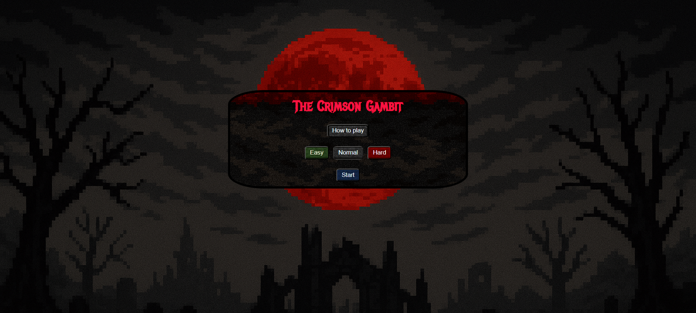

# 🕹️ Game Name: *The Crimson Gambit*
 Roguelike Deck Builder Game


## Made By: **Husain Folath**
 #### Connect with [Me](https://www.linkedin.com/in/hussain-folath-48b128197/)!


A **roguelike deck-building game** where players sacrifice **health to play powerful cards**. The game is inspired by titles like *Slay the Spire*, but introduces a risk-reward system where managing your HP is as important as managing your deck.

Players progress through encounters with enemies by strategically using cards drawn from their deck. Health is the primary resource used to play cards instead of traditional mana or energy. The game offers multiple difficulties, enemy types, and dynamic combat mechanics to create replayability.

**Why this game?**  
This concept explores the emotional and tactical weight of sacrificing your own vitality for victory. It challenges players to think critically and manage limited resources in creative ways.

---

## 🚀 Getting Started

- **Play the Game:** The [Link](https://the-crimson-gambit.surge.sh/index.html) to the game.
- **How to Play:** The game includes a "How to Play" button on the main menu explaining all mechanics.
- **Planning Materials:**
[draw.io](https://app.diagrams.net/#G1PyYV1US6-spDXPjkXFD70WIm6NSI6zyb#%7B%22pageId%22%3A%22N-C6wULLYs8-NzSbLSXE%22%7D) was used for the wireframe.
[Trello](https://trello.com/b/vqoMt1D0/rougelike-deck-builder-game) was used for time and task management. 

### Home Page Initial Design
## 

### Home Page Final Design
## 

### Battle Page Initial Design
## 

### Battle Page Final Design
## 

## 🧠 Game Design Plan

### 🎮 Game Features

- Difficulty Modes: Easy, Normal, Hard
- Difficulty affects card cost
- Core Game Loop:  
  `Start Match → Draw Phase → Play Phase → Enemy Phase → End Turn → Check Win/Loss`
- Game States:  
  `Main Menu`, `Battle`, `Victory`, `Defeat`


---

### 🃏 Card System

Cards will be stored in an array of objects:

```js
let Cards = [card1, card2, card3];

let card ={

    id: 1,
    name: "Blood Surge",
    cost: 3,
    type: "Power",
    powerup: 2,
    description: "Gain a temporary double damage on current cards.",
    alt: "A glowing blood rune surging with red energy."
  }
```
## 🃏 Card Attributes

- **ID**
- **Name**
- **Cost**
- **Type**
- **Effect**
- **Description**
- **Alt**

### Card Types May Include:
- Attack  
- Skill  
- Power  

> Once the player loses, no further actions should be allowed.

---

## 🧍 Player System

- Dynamic health bar  
- HP decreases when taking damage, increases with healing  
- Game over when health reaches **0 or less**  
- Ensure health **never displays as negative**

---

## 🤖 PVE / Enemy System

Enemy cards function similarly to player cards.

```js
let enemies = [enemy1, enemy2, enemy3];

let Enemy =  {
    id: 1,
    name: "Blood Ghoul",
    maxHealth: 14,
    health: 14,
    temper: "aggressive",
    deck: [2, 5, 7, 13, 3],
    move: {},
    moveId: null,
    alt: "A hunched, pale creature with torn flesh and glowing red eyes."
  }
```
## 🤖 Enemy AI Behavior

- **Simple AI** initially  
- **Thought bubble** displays enemy's intent (next move)

### AI Behavior Types

- **Aggressive:** Focuses on high damage  
- **Defensive:** Uses heals or shields  

---

## 🧱 Technologies Used

- JavaScript  
- HTML5  
- CSS3  

---

## 🙏 Attributions

Game concept and code by: Husain Folath

Special thanks to **[Abdulla Alshaikh](https://github.com/alshaikh-exe/)** and **[Mohamed Ali](https://github.com/mohammedali320)** for their design input

Debugging and styling help: [ChatGPT](https://chatgpt.com/) 

---

## 🚧 Next Steps

- Add a **deck-building system** between fights  
- Implement **relics** that provide passive effects  
- Introduce a **floor-based progression** map  
- Create **multiple unique enemies and bosses**  
- Add **sound effects and music**  
- Add **save/load functionality**  
- Ensure **mobile responsiveness**
